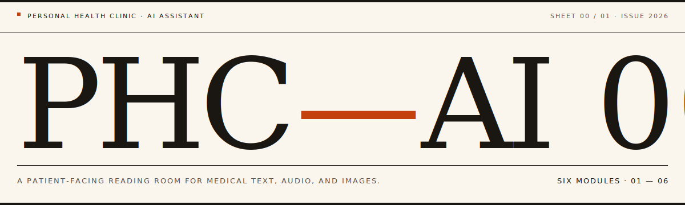

<p align="center">
  
</p>

<p align="center">
  <a href="https://phc-ai.vercel.app"></a>
  
  
</p>

<p align="center">
  
  
  
  
  
  
  
  
</p>

---

> **A patient-facing reading room for medical text, audio, and images.**
> Six small open-weight models. One quiet paper-and-ink interface. Built as a portfolio study in clinical typography.

PHC—AI explains post-visit materials — notes, reports, instructions, images, and audio. It is not for diagnosis, prescribing, or clinical use.

**Live:** [phc-ai.vercel.app](https://phc-ai.vercel.app)

## Design system

Swiss / Brockmann typographic discipline. Warm paper, single accent, all radii zero.

| Token        | Hex       | Role                                          |
| ------------ | --------- | --------------------------------------------- |
| Paper        | `#FAF6EE` | Primary background (oat / cream)              |
| Paper soft   | `#F3EEDF` | Subtle differentiation, hover wash            |
| Ink          | `#1A1612` | Primary text, rules, frames (warm near-black) |
| Ink soft     | `#5C5048` | Secondary text, mono micro-meta               |
| Ink faint    | `#8A8074` | Captions, hint text                           |
| Accent       | `#C2410C` | Burnt amber — em-dashes, focus, CTA           |
| Accent soft  | `#F4D3B8` | Accent washes, drag-target tint               |

**Typography**

- `font-sans` → [**Geist Sans**](https://vercel.com/font) — body, UI labels
- `font-mono` → [**Geist Mono**](https://vercel.com/font) — timestamps, route codes, mono micro-labels
- `font-display` → [**Fraunces**](https://fonts.google.com/specimen/Fraunces) italic — wordmarks, oversized numerals, empty-state posters

## Stack

| Layer    | Choice                                                         |
| -------- | -------------------------------------------------------------- |
| Frontend | Next.js 16 (App Router, Turbopack) · React 19 · TypeScript 5    |
| Styling  | Tailwind 4 · shadcn/ui (base-nova preset, `@base-ui/react`)     |
| AI UI    | Vercel ai-elements (`<Conversation>`, `<MessageResponse>`, …)   |
| Markdown | Streamdown (assistant-side rendering, code / math / mermaid)    |
| Icons    | lucide-react                                                    |
| Inference| Modal (serverless L40S) · FastAPI `/infer` · HF Transformers    |
| Deploy   | Vercel (frontend) · Modal (backend)                             |

## Modules

| #  | Workflow      | Model                          | Task          |
| -- | ------------- | ------------------------------ | ------------- |
| 01 | Visit Notes   | `google/medgemma-1.5-4b-it`    | `chat`        |
| 02 | Conversation  | `google/medasr`                | `asr`         |
| 03 | Image Match   | `google/medsiglip-448`         | `classify`    |
| 04 | Chest X-ray   | `google/cxr-foundation`        | `image_embed` |
| 05 | Skin          | `google/derm-foundation`       | `image_embed` |
| 06 | Pathology     | `google/path-foundation`       | `image_embed` |

## Run the frontend

```bash
npm install
npm run dev
```

Open `http://localhost:3000`.

Routes:

- `/` — landing poster
- `/chat` · `/conversation` · `/image-match` · `/chest-xray` · `/skin` · `/pathology`

Scripts:

```bash
npm run dev        # next dev (Turbopack)
npm run build      # next build
npm run start      # next start
npm run lint       # eslint .
npm run typecheck  # tsc --noEmit
```

## Deploy the backend

```bash
modal secret create phc-ai-hai-def-hf HF_TOKEN=hf_...
modal deploy modal/app.py
```

Copy `.env.example` to `.env.local` and set:

```bash
NEXT_PUBLIC_MODAL_INFER_URL=https://your-workspace--phc-ai-health-companion-inferenceservice-fastapi-app.modal.run/infer
```

See `modal/README.md` for the full env-var set (`MAX_LOADED_MODELS`, `MODAL_GPU`, `MODAL_APP_NAME`, `MODAL_VOLUME_NAME`, `MODAL_HF_SECRET_NAME`, `ALLOWED_ORIGINS`).

All six HAI-DEF repos are gated. The Hugging Face token must come from an account that accepted each model's license.

## Safety scope

- Do not upload PHI unless your deployment is compliant.
- All output is informational. Not a diagnosis, not a prescription, not emergency guidance.
- Verify every claim with a licensed clinician.
